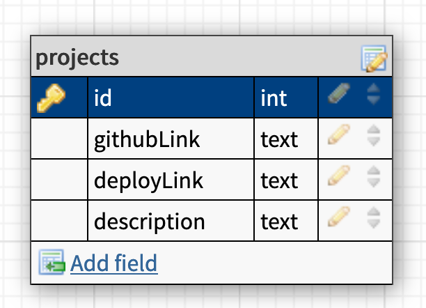

# Express Project Organizer

To practice N:M associations, we'll be adding the ability to categorize projects in an existing project organizer.

#### Backstory: Project Organizer

Keeping track of projects is a necessary part of peoples' personal lives and businesses. Another individual has created an open source project organizer that allows you to create and view projects, but it'd be nice to categorize projects. Let's add this functionality!

## Getting Started

We'll be using an existing application that includes one model, and a few routes.

* Fork and clone this repository
* Run `npm install` to install dependencies from the existing `package.json` file
  * Use `nodemon` to start your application
* Setup your database (this app already has one existing model)
  * Run `sequelize init:config` and update the config file
  * Run `sequelize db:create` to create the database
  * Run `sequelize db:migrate` to run migrations
  * Run `sequelize db:seed:all` to populate the database with 4 projects from previous Seattle cohorts.

#### Read the Code

After setup, **STOP**. You're using an existing application, so make sure to read the code and ensure what the application does. Here is some information about the current setup.

## Routes

| Method | Path | Purpose |
| ------ | -------------- | -------------------------------- |
| GET | `/` | index that READS all projects |
| POST | `POST /projects` | CREATES a new project, then redirects back to `GET /` |
| GET | `/projects/:id` | READS a specific project |

* Models
  * `project`
   * Attributes: `name`, `githubLink`, `deployedLink`, `description`

[here](https://www.getpostman.com/collections/1038496cce7b19d0500a) is a link to a postman collection of the routes.

## Database Schema



## User Stories

* As a user, I want to categorize projects using different names. For example, all of my Node projects will be under the category "Node".
* As a user, I want to assign multiple categories to a single project.
* As a user, I would like to assign a category when I create a new project
* As a user, I want to view a list of categories I've assigned.
* As a user, I want to view one category and all the projects in it
* As a user, I want to view projects associated with a category I've selected.

## Requirements

#### Part 1: Create a Category model

In order to add categories, create a Sequelize model to store categories. It's recommended that you name this model `category`. It will store one attribute: the name of the category (a string).

#### Part 2: Create a Join model

In order to associate a category to many projects, and a project to many categories, we'll need to create an intermediate model which will interface with a **Join table** in your db. It's recommended that you name this model `categories_projects`. It will store two attributes: the id of a category (an integer) and the id of a project (an integer).

Once created, add the associations need to create a many-to-many association between categories and projects, using the join table you just created. Be sure to test this functionality by creating categories and projects, then seeing if you can include them in different queries.


Remember: *This is a many to many relationship.* Many categories can have many pjects, and vice versa.

<details>
  <summary>Help! I'm not sure how to associate the models!</summary>

  

  ```js
  // in project.js
  static associate(models) {
    // define association here
    models.project.belongsToMany(models.category, {
      through: 'categories_projects'
    })
  }
  ```

  And a comment will belong to an article:

  ```js
  // in category.js
  static associate(models) {
    // define association here
    models.category.belongsToMany(models.project, {
      through: 'categories_projects'
    })
  }
  ```
</details>

**Test your db!**

```js
async function createCategory() {
  try{
    // READ a project
    const project = await db.project.findOne({
      where: { id: 1 }
    })
    // CREATE a category
    const newCategory = await db.category.create({
      name: 'Express'
    })
    // associate the category and project
    await project.addCategory(newCategory)

  } catch(error) {
    console.log(error)
  }
}

createCategory()
```

Note that these are two possible queries you can perform, so there are others that you'll want to test. Make sure you can have multiple projects associated with a given category, and also multiple categories associated with a given project.

Since both category and project belongsToMany, all of the [sequelize helper](https://sequelize.org/master/manual/assocs.html#-code-foo-hasmany-bar---code-) methods for associations are availible to both.

#### Part 3: Plan your **RESTful** API

Now that the models have been created, you'll want to add the ability to create categories, view categories, and view projects by category to the rest of the application.

Take moment and plan out your routes. Consider the following functionality:

* Showing all projects along with thier catagories
* Adding categories when new projects are created
* Showing a single project along with all of the categories that it is in
* creating an association between and existing project and an existing category
* Showing all categorories available
* Making a new category
* Showing one category and all the projects that are in it

What routes will you need to accomplish these? Would you need to modify the existing routes or add news ones? Will you need another controller?

Using the [RESTful API](https://docs.google.com/spreadsheets/d/1J30GHznAqAL-BBaTeV9slGHPC8sZLPoKorDuEGe7mZ0/edit?usp=sharing) spreadsheet as a reference, plan the URL paths and CRUD functionality of your routes.

#### Part 4: Stubbing routes

Using the handy **RESTful** routing resource document that you just generated, stub those routes! Just use simple responses in your route stubs to ensure that everyhting is linked up.

#### Part 5: Adding CRUD functionality

Once your routes are stubbed, and everything is responding to your requests, integrate your model! You can use your testDb.js to write the sequelize methods for your db CRUD first prior to integrating them into your routes if you like. 

## Bonuses

* Add the ability to edit and delete projects and categories
* Add the ability to input and assign multiple tags via a comma separated list.
  * Example: Inputting `node, pizza, music` would add all three tags to a project at once.

---

## Licensing
1. All content is licensed under a CC-BY-NC-SA 4.0 license.
2. All software code is licensed under GNU GPLv3. For commercial use or alternative licensing, please contact legal@ga.co.
